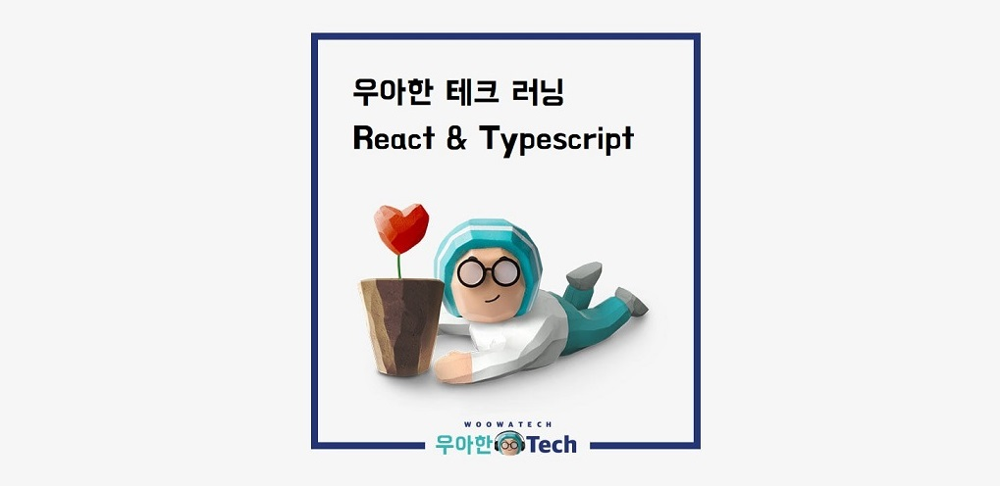

​    

## 💎우아한 테크 러닝 3기 React & Typescript

🎤 강사 : 우아한형제들 김민태 님 (웹프론트엔드개발그룹장)

📃 내용 : React와 TypeScript 기반의 웹앱 개발 교육

📆 일정 : 2020년 9월 1일(화)부터 4주간 매주 화,목 19:30~22:00 

​    

## 📁 스터디 정리

✔ 1일차 : [[내용 정리]](./lecture1/lecture1.md)

✔ 2일차 : [[내용 정리]](./lecture2/lecture2.md), [[리덕스 구현]](./lecture2/makeRedux.md)

✔ 3일차 : [[내용 정리]](./lecture3/lecture3.md), [[트랜스 파일링 구현]](./lecture3/example), [[useState 구현]](./lecture3/example2)

✔ 4일차 : [[내용 정리]](./lecture4/lecture4.md)

✔ 5일차 : [[내용 정리]](./lecture5/lecture5.md)

